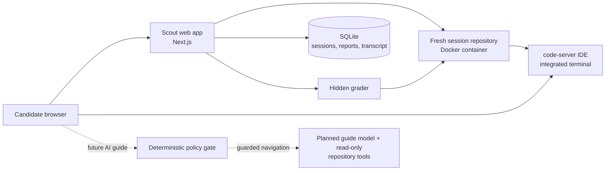

# Scout - repository interviews for the AI era

> An OpenAI Builder Week project that replaces puzzle-style coding rounds with realistic, browser-based codebase investigations.

Scout gives a candidate a production-shaped repository instead of an isolated
algorithm prompt. They identify and improve the bottlenecks they can reach;
the interviewer receives reproducible tests, benchmark evidence, and
mission-level progress. The AI interview guide is intentionally presented as a
coming-soon preview while the repository experience takes center stage.

The goal is not to make interviews "AI-proof." It is to make engineering
judgment visible: how someone maps an unfamiliar system, chooses a bottleneck,
checks invariants, improves performance, and explains the trade-offs.

## What judges can try

| Capability | What it provides |
| --- | --- |
| **9 repository environments** | Python, TypeScript, and C++ services spanning logs, payments, caching, matching, scheduling, recommendations, search, routing, and risk allocation. |
| **45 measurable missions** | Every pack has five independent performance opportunities, distributed across a multi-file codebase rather than exposed as named DSA exercises. |
| **Partial-success grading** | Completing two or three missions well is a strong result. The scorecard shows correctness, benchmark progress, and proximity to a golden reference. |
| **Browser-native workspace** | Each session creates a fresh repository inside a Docker-backed code-server IDE, with an integrated terminal for `make test` and `make bench`. |
| **Replay variants** | A persisted per-session seed changes workload shape and ticket framing while keeping the public API and mission rubric comparable. |
| **AI interview guide (coming soon)** | The demo previews a planned, constrained codebase guide instead of exposing an empty chatbox. The repository, scoring, and browser workflow are available today. |
| **Interviewer evidence** | The live view shows elapsed time, submissions, visible and hidden test totals, benchmark deltas, mission cards, concepts, and the session log. |
| **Open-ended sessions** | Tasks are designed for roughly an hour, but Scout never hard-stops a session; the interviewer sees elapsed time and ends it manually. |

## Fastest judge path

The shortest end-to-end demo starts the Python LogScope interview. It requires
Node.js **22.6+**, Git, ripgrep (`rg`), and a Docker daemon running Linux
containers. Use Docker Desktop on Windows or macOS, or Docker Engine on Linux.
On Linux, make sure your current user can run `docker` without `sudo`. Python
is included in the candidate image, so it is not needed on the host for this
flow.

### Windows PowerShell

```powershell
git clone <repository-url>
Set-Location openai_interview_platform
Copy-Item .env.example .env
npm ci

# Builds the image needed for the LogScope Python task.
docker build -t challenge-py images/challenge-py

npm run dev
```

### Linux / macOS Bash

```bash
git clone <repository-url>
cd openai_interview_platform
cp .env.example .env
npm ci

# Builds the image needed for the LogScope Python task.
docker build -t challenge-py images/challenge-py

npm run dev
```

Open [http://localhost:3000/admin](http://localhost:3000/admin), click **Start
session** on **LogScope**, then open the candidate workspace link shown by the
app. Enter the generated IDE password when code-server asks for it. In the
browser terminal, run:

```bash
make test
make bench
```

Click **Submit**, then open the interviewer view to inspect the grade report.
Use **End session** when finished to remove the container.

The first image build downloads the pinned code-server bundle and can take a
little longer. Docker Hub and GitHub access are needed during that build.

### Run the entire portfolio

Build all three language images before starting TypeScript or C++ tasks:

```powershell
npm run images:build
```

This is equivalent to building `challenge-py`, `challenge-ts`, and
`challenge-cpp` individually. The images run code-server as a non-root
candidate user and include only the language runtime, compiler/tooling, Git,
Make, and support needed for the browser workspace and grader.

`PUBLIC_HOST` in `.env` is a **hostname or IP only**. Keep the default
`localhost` for a local demo; do not include the Next.js port in that value.

## A 90-second judge demo

For the clearest walkthrough, prepare one baseline session and one improved
submission rather than asking a judge to implement a change live.

1. Start a LogScope session and show the task ticket, multi-file tree, and
   browser terminal.
2. Run `make test` and `make bench` to establish the candidate baseline.
3. Open the **AI guide** tab to show the intentional coming-soon preview rather
   than an unconfigured chatbox.
4. Open the interviewer view to show the matching coming-soon status alongside
   the session controls and replay profile.
5. Reveal a prepared candidate improvement, rerun the benchmark, and submit.
6. In the interviewer view, show hidden-test totals, mission-level timings,
   the replay seed/profile, elapsed time, session pulse, and session log.

## Why these interviews feel like engineering work

Each pack contains a candidate repository with correct-but-inefficient paths,
visible tests, a benchmark workload, and intentional TODO extension seams.
The candidate can improve a coherent subset without rewriting the service.
Golden implementations and hidden grader assets are included in this hackathon
checkout so the evaluation is reviewable; in a real deployment they belong in
private grader storage.

The following labels are for interview calibration and follow-up; candidates
see product tickets and service vocabulary rather than a list of DSA topics.

| Pack | Scenario | Language | Interviewer-calibration concepts |
| --- | --- | --- | --- |
| `logscope-py` | Time-range log analysis | Python | Binary search, hashing, inverted index, heap, sliding window |
| `payfix-py` | Nightly payment reconciliation | Python | Hash maps, composite keys, grouping, memoization, heaps |
| `gateway-cache-ts` | Bounded API response cache | TypeScript | Hash maps, linked list, reverse index, fan-in, batching |
| `orderbook-py` | Exchange matching engine | Python | Price levels, hash maps, heaps, ordered lookup, deques |
| `dispatch-scheduler-ts` | Dependency-aware job scheduling | TypeScript | Graphs, in-degree, priority queues, min-heaps, interval search |
| `recofeed-py` | Recommendation feed assembly | Python | Hash sets/maps, top-K heaps, cache invalidation, batching |
| `route-mesh-ts` | API route resolution | TypeScript | Tries, prefix maps, prefix sums, binary search, cache invalidation |
| `inventory-search-py` | Commerce inventory search | Python | Tries, inverted indexes, hash joins, binary search, pagination |
| `risk-router-cpp` | Low-latency risk allocation | C++20 | Secondary indexes, prefix sums, binary search, versioned caches |

## Grading philosophy

Scout is deliberately not a "finish every TODO or fail" system. Each mission
has an equal default weight, and the automated score combines:

- correctness and invariant evidence (35%),
- improvement from the candidate baseline (35%),
- progress toward the golden benchmark (20%), and
- hidden-test confidence (10%).

The interviewer still evaluates code quality, prioritization, communication,
and trade-offs. As a guide, one meaningful mission is progress; two or three
well-executed missions is a strong interview; broad, correct improvement is
exceptional. See [INTERVIEW-FRAMEWORK.md](INTERVIEW-FRAMEWORK.md) for the full
challenge and scorecard contract.

## How the browser workflow works



Creating a session copies the candidate repository, writes a deterministic
replay profile, starts its language-specific Docker image, and embeds
code-server in the candidate page. The candidate terminal and hidden grader
run in the same container, so `make test`, `make bench`, and the submitted
workspace use the same toolchain.

On submission, Scout copies only the hidden grader into that container. The
grader emits a structured `REPORT_JSON` record, which Scout stores in SQLite
and turns into an interviewer scorecard.

## AI interview guide: coming soon

The candidate UI intentionally does not expose a chatbox in this demo. The
future AI interview guide will be a constrained navigation layer, not an
autonomous coding agent.

- A deterministic pre-flight policy rejects common prompt injection, solution,
  diagnosis, debugging, implementation, and optimization requests, as well as
  oversized messages, before they are sent to a model.
- Its tool surface is limited to scoped directory listing, symbol search, text
  search, and file reads within the candidate repository. It has no write,
  shell, network, or grader tools.
- The policy and tool layer is staged behind the coming-soon experience while
  the live demo focuses on repository work and grading evidence.

The core workspace, grading, and scorecard run without an LLM provider. An
Ollama-compatible endpoint or Anthropic configuration is only needed while
developing the future guide.

## Replay variants

Every new session receives a random, persisted seed. It selects a
pack-specific replay profile, changes benchmark fixture shape and ticket
wording, and records the profile with the session. The public API, mission IDs,
and grading thresholds remain stable so benchmark evidence stays comparable.

This makes rote answer reuse less useful while retaining reproducibility for
the interviewer. It does not prove that someone did not use an external
assistant. Read [VARIANT-CALIBRATION.md](VARIANT-CALIBRATION.md) for calibration
and host-specific benchmark guidance.

## Verify a checkout

These checks do not need Docker or an LLM provider:

```powershell
npm run verify
```

The expanded equivalent is:

```powershell
npm run typecheck
npm run lint
npm run build
node tests/test_grading.mjs
npm run variant-test
npm run test:public-host
```

After building the Docker images, use the browser flow above for the full
container-backed smoke test.

## Built for OpenAI Builder Week

Scout is built with Next.js, React, TypeScript, SQLite, Docker, code-server,
and the Vercel AI SDK. Codex and GPT-5.6 accelerated implementation of the
Next.js/Docker scaffolding, challenge-pack structure, replay variants, and
deterministic guardrail/evidence design. The human builder set the interview
safety boundary, reviewed the code paths, and made the final product decisions.

GPT-5.6 is not Scout's runtime interviewer model. The staged guide supports an
Anthropic model or an OpenAI-compatible local endpoint during development. The
submission outline and 3-minute demo script live in
[DEVPOST-SUBMISSION.md](DEVPOST-SUBMISSION.md).

## Project map

```text
app/          Next.js pages and API routes
lib/          SQLite, Docker session lifecycle, grader, variants, Scout policy/tools
challenges/   9 candidate/golden repository packs, graders, variants, and metadata
images/       Minimal Python, TypeScript, and C++ browser-workspace images
scripts/      Image build, challenge indexing, and replay calibration checks
```

## Demo boundaries and production follow-up

This repository is intentionally a local hackathon demo, not a public
multi-tenant deployment.

- App and session APIs currently have no enforced access control. Do not expose
  this demo on a public network.
- The IDE is embedded over HTTP for local use. A public deployment needs
  authentication, HTTPS/reverse-proxy handling, and a deliberate browser-origin
  design.
- Docker resource limits help contain a session, but production outbound-network
  controls need host/firewall policy; the demo is not a claim of complete egress
  isolation.
- The staged AI guide policy layer and replay variants are useful layers of
  interview evidence, not a formal guarantee against every adversarial prompt
  or unauthorized tool.
- Golden repositories, hidden tests, and benchmark calibration need to move to
  protected infrastructure for a real assessment product.

For the task design and delegation record, see
[INTERVIEW-FRAMEWORK.md](INTERVIEW-FRAMEWORK.md) and [HANDOFFS.md](HANDOFFS.md).
